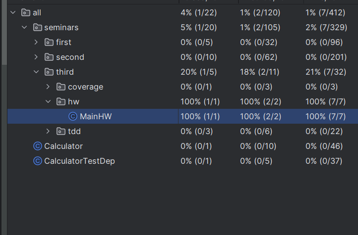
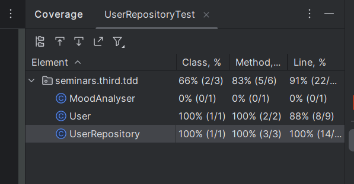

### Задания 1 и 2

```java
class MainHWTest {
    MainHW mainHW = new MainHW();

    @Test
    void evenOddNumberTest() {
        assertTrue(mainHW.evenOddNumber(100));
        assertFalse(mainHW.evenOddNumber(1001));
    }
    @Test
    void numberInIntervalTest() {
        assertTrue(mainHW.numberInInterval(100));
        assertFalse(mainHW.numberInInterval(1001));
        assertTrue(mainHW.numberInInterval(27));
    }
}
```



### User

```java
public class User {

    String name;
    String password;

    boolean isAdmin;

    boolean isAuthenticate = false;

    public User(String name, String password, boolean isAdmin) {
        this.name = name;
        this.password = password;
        this.isAdmin = isAdmin;
    }

    //3.6.
    public boolean authenticate(String name, String password) {
        if (name.equals(this.name) && password.equals(this.password)) {
            this.isAuthenticate = true;
            return true;
        }
        return false;
    }
}
```
### UserRepository
```java
public class UserRepository {

    // Тут можно хранить аутентифицированных пользователей
    List<User> data = new ArrayList<>();

    public void addUser(User user) {
        if (!this.data.contains(user)) {
            user.authenticate(user.name, user.password);
            this.data.add(user);
        }
    }

    public void unLoginNoAdmins() {
        for (int i = 0; i < this.data.size(); i++) {
            if (!this.data.get(i).isAdmin) {
                this.data.get(i).isAuthenticate = false;
                this.data.remove(i);
            }
        }
    }

    public boolean findByName(String username) {
        for (User user : data) {
            if (user.name.equals(username)) {
                return true;
            }
        }
        return false;
    }

}
```
### UserRepositoryTest
```java

class UserRepositoryTest {

    @Test
    void unLoginNoAdmins() {
        UserRepository userRepository = new UserRepository();
        userRepository.addUser(new User("Boss", "ImTheKingOfTheKING777", true));
        userRepository.addUser(new User("Waiter", "iHateMyJob", false));
        userRepository.addUser(new User("Counter", "IHateTaxes", true));
        userRepository.addUser(new User("Security", "INeedNewJob", false));

        userRepository.unLoginNoAdmins();

        assertTrue(userRepository.findByName("Boss"));
        assertFalse(userRepository.findByName("Waiter"));
        assertTrue(userRepository.findByName("Counter"));
        assertFalse(userRepository.findByName("Security"));
    }
}
```

